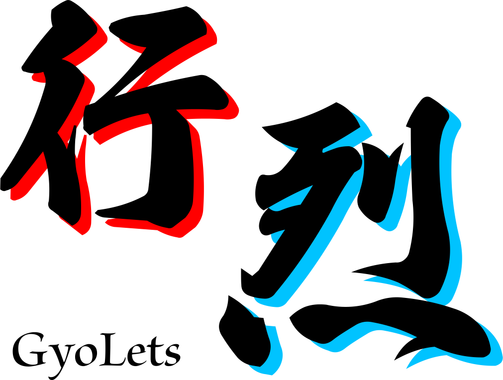

# gyolets
## Abstract
行列の簡約化を行なうライブラリです。  
CLIツールとして使えるほか、ライブラリとして他のプログラムやWebアプリに組み込んで使うこともできます。  

## Usage
### CLI
```bash
npm install -g @toriyama/gyolets
gyolets -m "[[1,2,3], [4,5,6], [7,8,9]]"
```
```console
1	0	-1
0	1	2
0	0	0
```

### JavaScript
```bash
npm install @toriyama/gyolets
```
```javascript
import Gyolets from "@toriyama/gyolets";
const mat = new Gyolets([
	[1, 2, 3],
	[4, 5, 6],
	[7, 8, 9]
], {row: 3, column: 3});
const reducedMat = mat.reduction({
	rapid: true,
	verbose: false
});
console.log(reducedMat.toString());
```
```console
1	0	-1
0	1	2
0	0	0
```

## Docs
[https://yuukitoriyama.github.io/gyolets/](https://yuukitoriyama.github.io/gyolets/)

## License
MIT License

## Author
YUUKIToriyama